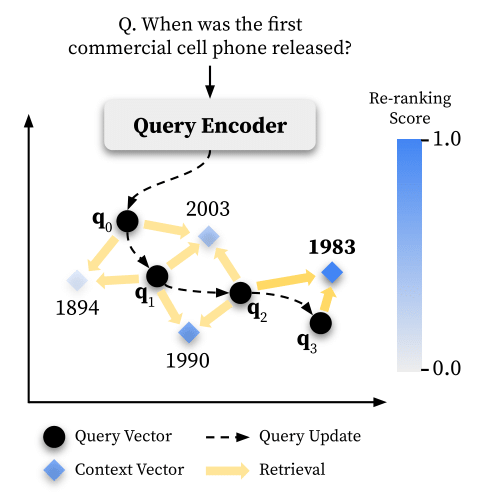

# TouR: Optimizing Test-Time Query Representations for Dense Retrieval

<div align="center">
  
</div>

**TouR** optimizes instance-level query representations guided by cross-encoders at test time for dense retrieval.
Please see our ACL findings paper [
Optimizing Test-Time Query Representations for Dense Retrieval (Sung et al., 2023)](http://https://arxiv.org/abs/2205.12680) for more details.

## **TouR** for Phrase Retrieval

### Installation

To use TouR for phrase retrieval, we suggest first installing [DensePhrases v1.1.0](https://github.com/princeton-nlp/DensePhrases/tree/v1.1.0), which is a state-of-the-art phrase retrieval model.

```
git clone -b v1.1.0 https://github.com/princeton-nlp/DensePhrases.git
cd DensePhrases

# Install from environment.yml (python >= 3.8, transformers==4.13.0)
conda env create --file environment.yml -n TouR
conda activate TouR

# Install DensePhrases
python setup.py develop

# Running config.sh will set the following three environment variables:
# DATA_DIR: for datasets (including 'kilt', 'open-qa', 'single-qa', 'truecase', 'wikidump')
# SAVE_DIR: for pre-trained models or index; new models and index will also be saved here
# CACHE_DIR: for cache files from Huggingface Transformers
source config.sh
```

After installing DensePhrases, you will need to download the [resources](https://github.com/princeton-nlp/DensePhrases/tree/v1.1.0#resources) such as datasets, phrase indexes, and pre-trained models.


### Running **TouR**

To run TouR for open-domain question answering, you need to execute the following script.
The example script demonstrates applying TouR<sub>hard</sub> to the NQ testset. 
Once executed, the prediction file will be generated in $OUTPUT_DIR.

```
TEST_PATH='/path/to/densephrases-data/open-qa/nq-open/nq_test_preprocessed.json'
LOAD_DIR=princeton-nlp/densephrases-multi-query-multi
CE_DIR='/path/to/phrase_reranker_multi' # see the model list below
OUTPUT_DIR='/path/to/output'
PSEUDO_LABELER_TYPE='hard' # or 'soft'

CUDA_VISIBLE_DEVICES=0 python -u run_tour_densephrases.py \
	--run_mode test_query_vec \
	--cache_dir ${CACHE_DIR} \
	--test_path ${TEST_PATH} \
	--per_device_train_batch_size 1 \
	--warmup_steps 0 \
	--dump_dir ${SAVE_DIR}/densephrases-multi_wiki-20181220/dump/ \
	--index_name start/1048576_flat_OPQ96 \
	--load_dir ${LOAD_DIR} \
	--output_dir ${OUTPUT_DIR} \
	--pseudo_labeler_name_or_path ${CE_DIR} \
	--pseudo_labeler_type ${PSEUDO_LABELER_TYPE} \
	--pseudo_labeler_p 0.5 \
	--pseudo_labeler_temp 0.5 \
	--learning_rate 1.2 \
	--num_train_epochs 3 \
	--top_k 10 \
	--rerank_lambda 0.1 \
	--cuda \
	--top1_earlystop \
	--truecase
```

#### Model list

We have uploaded our phrase re-rankers on the Huggingface hub.

- [Phrase Re-ranker for NQ|TriviaQA|SQuAD](https://huggingface.co/dmis-lab/phrase-reranker-multi)
- [Phrase Re-ranker for WQ](https://huggingface.co/dmis-lab/phrase-reranker-multi-wq)
- [Phrase Re-ranker for TREC](https://huggingface.co/dmis-lab/phrase-reranker-multi-trec) 


## Citations
```bibtex
@inproceedings{Sung2022OptimizingTQ,
  title={Optimizing Test-Time Query Representations for Dense Retrieval},
  author={Mujeen Sung and Jungsoo Park and Jaewoo Kang and Danqi Chen and Jinhyuk Lee},
  year={2022}
}
